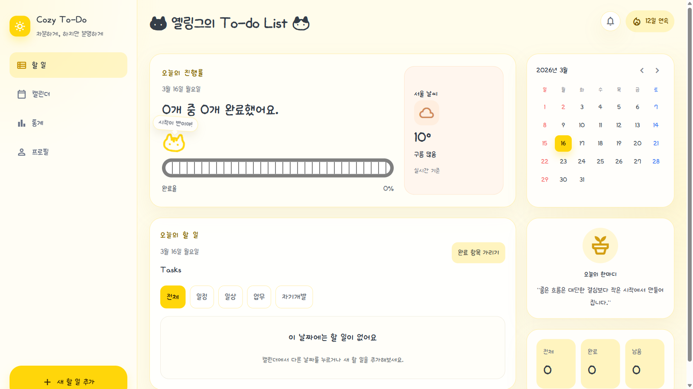

# 옐링그의 To-do List

따뜻한 감성의 데스크톱형 투두 대시보드를 React로 구현한 프로젝트입니다.  
캘린더 날짜 선택, 진행률 시각화, 카테고리 필터, 날씨 패널, 모달 기반 할 일 추가 흐름까지 한 화면에서 볼 수 있도록 구성했습니다.

## 화면 미리보기



## 사용 기술

- `React 19`
- `Vite 7`
- `JavaScript (ES Modules)`
- `CSS`
- `Open-Meteo API`

## 주요 기능

- 우측 캘린더에서 날짜를 클릭하면 해당 날짜 기준으로 진행률, 할 일 목록, 통계가 함께 갱신됩니다.
- `일정 / 일상 / 업무 / 자기개발` 카테고리별로 할 일을 분류하고 필터링할 수 있습니다.
- 완료 항목 숨기기 토글로 완료된 할 일을 가려서 볼 수 있습니다.
- 중앙 모달 레이어에서 새 할 일을 추가할 수 있고, 선택 중인 날짜에 바로 저장됩니다.
- 진행률 카드에서 완료율과 러너 애니메이션, 구간별 말풍선 문구를 함께 확인할 수 있습니다.
- 서울 기준 실시간 날씨 정보를 진행률 카드 우측 패널에서 볼 수 있습니다.
- 로컬 스토리지를 사용해 새로고침 후에도 할 일 데이터가 유지됩니다.

## 테스트 데이터

- `2026년 3월 9일` 날짜에 캘린더 연동 확인용 테스트 할 일 3개가 포함되어 있습니다.
- 캘린더에서 `3월 9일`을 클릭하면 목록과 진행률이 즉시 변경되는 흐름을 확인할 수 있습니다.

## 실행 방법

```bash
npm install
npm run dev
```

브라우저에서 `http://127.0.0.1:5173`으로 접속하면 됩니다.

## 빌드

```bash
npm run build
```

## 프로젝트 포인트

- 감성적인 노란 톤 대시보드 UI
- 한국어 중심 UX
- 날짜 기반 할 일 관리
- 모달 중심 입력 흐름
- 진행률과 일정 상태를 한눈에 볼 수 있는 레이아웃
